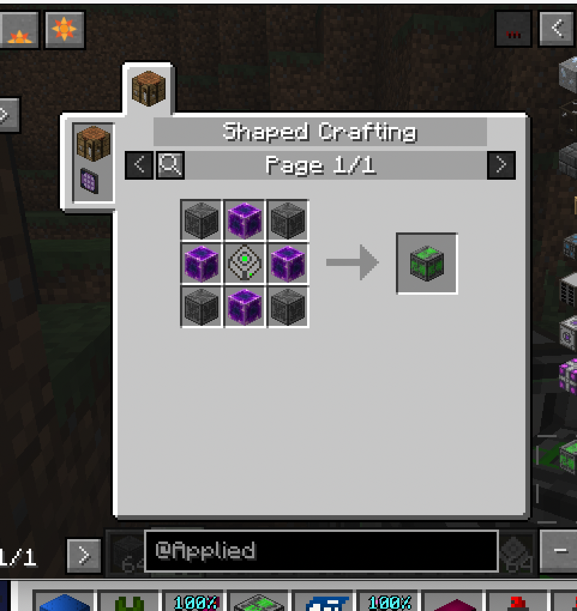
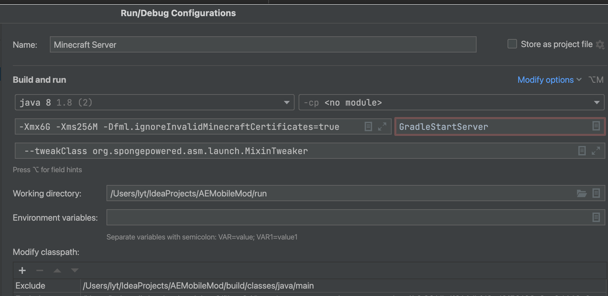

# Minecraft 赛博监工装置

方块：尼哥监控器  
放置在ME控制器边上以注册ME网络到http接口  
合成表：  
需要配合[尼哥监控器客户端](https://github.com/koiNoCirculation/AEMobile)app使用  

## 构建
spring boot的jar包含java9类，不兼容1.7的forgegradle，因此用了一个私货FG构建，否则remap会报错。  
classpath 'net.minecraftforge.gradle:ForgeGradle:1.2.13.dirty'的版本需要自行进行mvn install。  
安装命令如下：  
```bash
mvn install:install-file -Dfile=ForgeGradle-1.2.13-dirty.jar -Dversion=1.2.13-dirty -DartifactId=ForgeGradle -Dpackaging=jar -DgroupId=net.minecraftforge.gradle
mvn install:install-file -Dfile=SpecialSource-1.7.3-m-shaded.jar -Dversion=1.7.3-m -DartifactId=SpecialSource -Dpackaging=jar -DgroupId=net.md-5           
```
由于spring boot和mc内部的一些包冲突，打包用了包重定位手段，因此直接run client会报错，需要对IDEA的run server和run client进行设置。    

classpath选项删除，排除掉build/classes/java/main目录以完全把mod的文件排除出去。我们需要使用打好的dev包来运行。  
复制lib/aemobile-xxx.dirty-dev.jar到run/mods以让GradleStart加载打好包的dev mod，即可完成启动，遇到报错提示，忽视它继续运行即可。  


