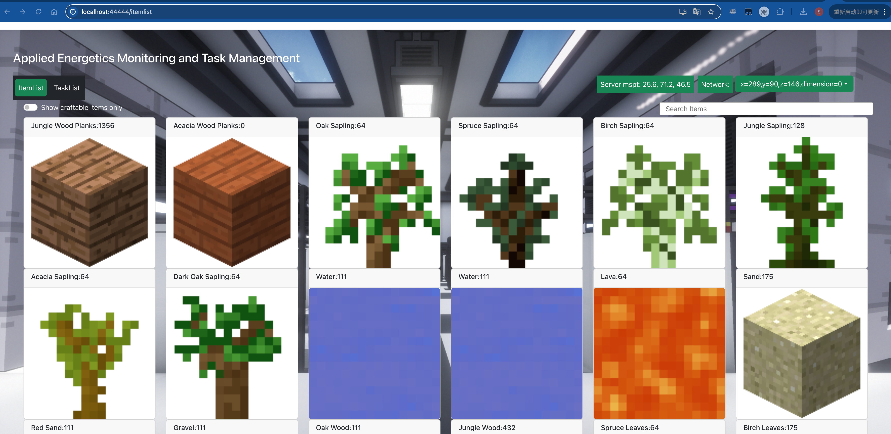
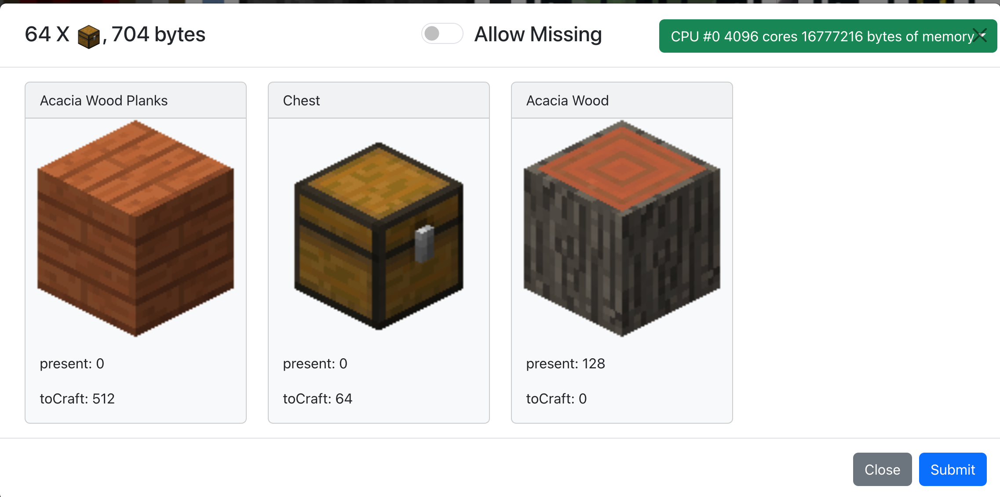
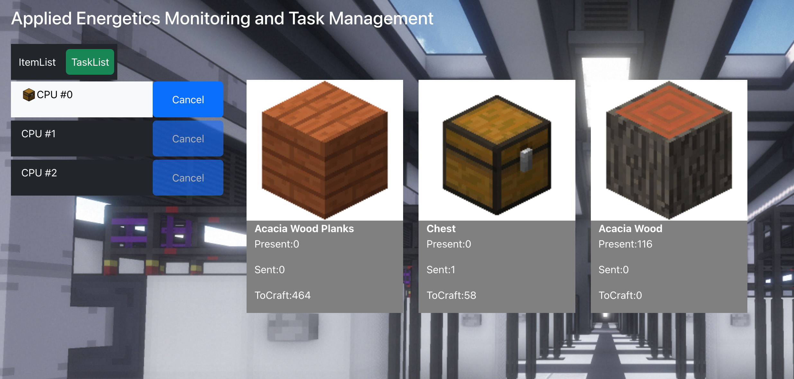
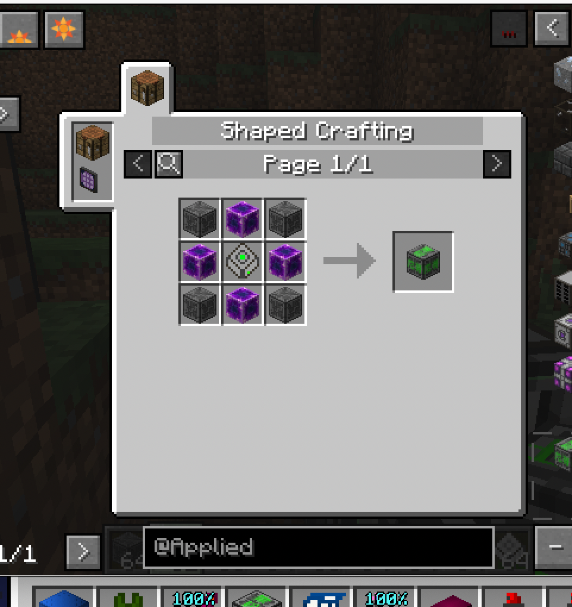
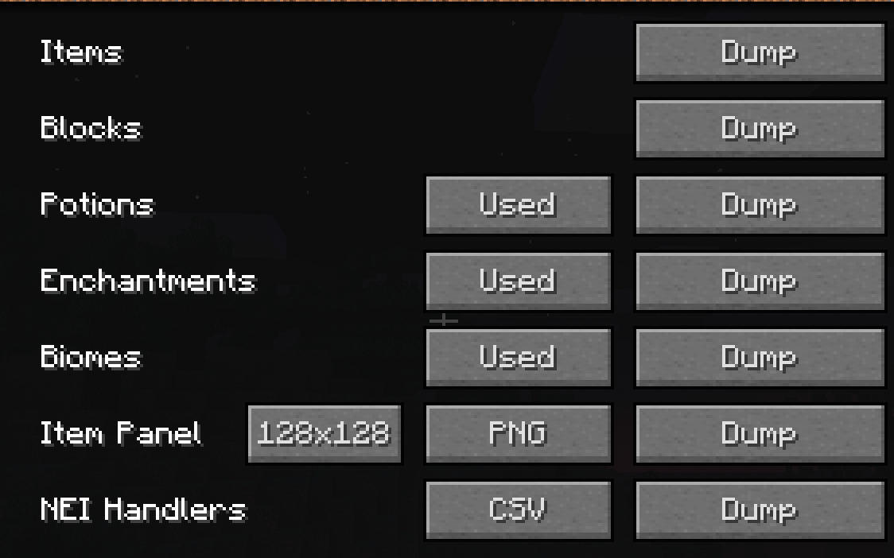
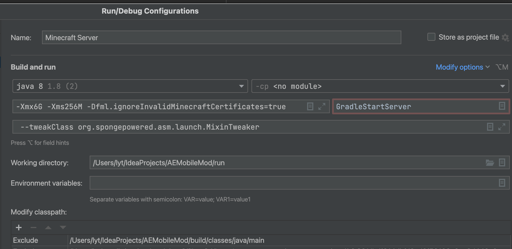

# Monitor of Applied Energetics on web

## Overview Page

## Craft Page

## CPU Monitoring Page

## EN:
This mod provides a web api for monitoring the AE outside of the game.  
Placing the 'Applied Energetics Monitor' beside the ME network exposes the network to the API.  
Recipe:  . 
When placing the block it will print a password in chat, then visit http://server-address:44444 and setup with this password to access it.
As server administrator you need to generate icons before using the webui. 

You need to install mod to client and open the 'Data Dump' tool in 'Not Enough Items', so all icons of items are exported.  
And then you should upload the directory called 'dumps' to the root of your minecraft server pack.
## CN
本模组提供通过http接口在外部监控AE的能力 . 
方块：AE监控器    
合成表： . 
放置在ME控制器边上以注册ME网络到http接口，放置时会在聊天框提供密码，使用该密码访问 http://服务器地址:44444，即可完成设置。  
使用webUI前你需要先导出图标。  
将mod安装到客户端，并在单机模式下打开NEI的“数据导出”功能，选择导出图标，分辨率选128.  
导出完成后请把dumps目录复制到服务端的根目录下以使其生效。
## Build
Run ./gradlew build  

## Dev
由于spring boot和mc内部的一些包冲突，打包用了包重定位手段，因此直接run client会报错，需要对IDEA的run server和run client进行设置。    

classpath选项删除，排除掉build/classes/java/main目录以完全把mod的文件排除出去。我们需要使用打好的dev包来运行。  
复制lib/aemobile-xxx.dirty-dev.jar到run/mods以让GradleStart加载打好包的dev mod，即可完成启动，遇到报错提示，忽视它继续运行即可。  

